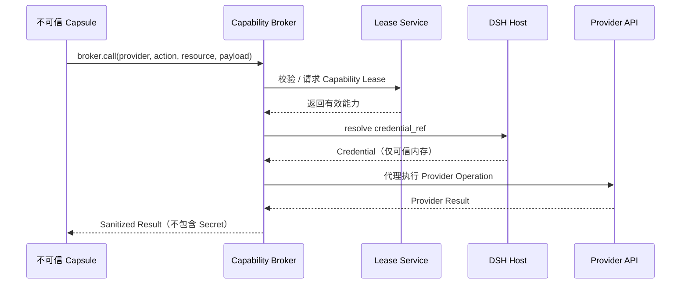

<p align="center">
  
</p>

<p align="center">
  <a href="#-deepseek-harness-插件"></a>
  <a href="#-deepseek-harness-插件"></a>
  
  
  
</p>

<p align="center">
  <b>让不可信 Agent 工具安全运行。授予能力，而不是交出凭证。</b>
</p>

<p align="center">
  <b>DSH Capability Guard</b> 是面向 <b>DeepSeek Harness</b> 的通用 Tool 短期授权 + Managed Extension Broker 插件。<br/>
  任何原本触发 DSH Approval 的已装插件零代码改造即获得短期、Session 绑定、可撤销的 Capability Lease；遵循 Guard 标准开发的 Managed Extension 进一步由 Broker 代解析凭证与调用 Provider。
</p>

<p align="center">
  <a href="README.md">English</a> · <b>简体中文</b>
</p>

<p align="center">
  <a href="#-为什么需要-dsh-capsule">为什么需要它？</a> ·
  <a href="#-整体架构">整体架构</a> ·
  <a href="#-安全模型">安全模型</a> ·
  <a href="#-快速开始">快速开始</a> ·
  <a href="#-开发一个-capsule">开发 Capsule</a> ·
  <a href="#-security-in-action">安全测试</a> ·
  <a href="#-roadmap">Roadmap</a>
</p>

---

## 🔌 DeepSeek Harness 插件

> **DSH Capsule 以独立 DeepSeek Harness Plugin 的形式工作，不修改 DeepSeek Harness Core。**

Guard 以横切方式接入 DSH 原生 Tool Pipeline（`tools/pre-execute` / `approval/request` / `tools/result` 三个 hook），只增强而不替代 DSH 原生 Approval / Credentials / Sandbox；全部核心逻辑为纯 TypeScript，无任何外部 Runtime 依赖。

> [!IMPORTANT]
> **当前状态：**《DSH Capability Guard 重构规格》Phase 0–4 已完成——Universal 短期授权（Lease 签发 / 复用 / 过期 / 撤销 / 审计）、Managed Capability Service、Credential Broker（GitHub Provider）与 Governance Console 均已实现。接入真实 DSH/Cordis API 的联调基线尚未完成（规则 4：以当前安装版本的 TypeScript 类型定义为准），因此当前版本定位为 **Developer Preview**。

> [!WARNING]
> **Legacy Isolated Runtime（已移除）：**旧的 Docker 隔离式 Runtime（`runtime/`、`capsules/`、`sdk/python/`、`cli/` 与 `adapter/src/legacy/`）已按项目决策**整体移除、不再预留**——本插件不再有任何 Python / Docker / Unix Domain Socket 依赖，Windows / macOS / Linux 纯 TypeScript 运行。下文涉及 Docker Capsule / Python Runtime / Capsule SDK 的章节为**历史文档**，仅描述移除前的设计，不再对应仓库现状。

> [!TIP]
> **DSH Capability Guard（默认主链路）：**纯 TypeScript 实现的 Universal 短期授权（Phase 1）、Managed Capability Service（Phase 2）、Credential Broker（Phase 3）与 Governance Console（Phase 4）。Console 提供两个只读观测入口：
> - **编程 API**：`GovernanceConsole.snapshot()` / `queryAudit()`（插件内直接聚合 Lease / Capability / Provider / Audit / Tool 统计五维视图）；
> - **本地 HTTP 查看器**：插件配置 `console: { enabled: true, host: "127.0.0.1", port: 8787 }` 启动，仅监听 loopback、仅接受 GET（`/` 页面、`/api/snapshot`、`/api/audit`），响应带 `no-store` / `nosniff` / CSP；默认关闭（不开任何端口）。Console 数据全部为白名单投影——不含 Secret、原始 Tool Arguments 与 Credential（引用名 `credentialRef` 除外，它不是 Secret）。


---

## ✦ 为什么需要 DSH Capsule？

Agent 正在从“回答问题”走向“执行真实操作”。与此同时，Tool / Plugin 生态会越来越开放。

这意味着 Agent 可能开始运行来自第三方的代码，而第三方插件可能：

- 依赖存在供应链漏洞；
- 读取宿主机文件或环境变量；
- 访问 Docker Socket 获取宿主控制权；
- 绕过 Agent 权限直接访问公网；
- 长期持有 GitHub、云服务、企业系统 Token；
- 发起未声明的高危操作；
- 死循环、崩溃或返回超大结果拖垮 Agent Runtime。

传统插件系统往往把两个完全不同的问题混在了一起：

1. **这段插件代码能不能运行？**
2. **这个插件此时此刻究竟被允许做什么？**

DSH Capsule 将两者彻底拆开。

<table>
<tr>
<td width="33%" valign="top">
<h3>🛡️ 隔离式 Plugin Runtime</h3>
第三方代码不进入 Harness 主进程，而是在明确受限的 Docker Capsule 中执行，默认不给予任何宿主环境能力。
</td>
<td width="33%" valign="top">
<h3>🔑 Capability Lease</h3>
外部操作通过短生命周期、Session 绑定、资源级、Action 级且可主动撤销的能力租约授权。
</td>
<td width="33%" valign="top">
<h3>🔒 Zero-Secret Plugin</h3>
长期凭证只存在于可信宿主侧，每次 Provider Operation 动态解析，永远不注入第三方插件容器。
</td>
</tr>
</table>

### 一句话理解

> **插件可以做事，但插件不需要拥有宿主。**

更进一步：

> **让第三方 Agent 插件拥有 Capability，而不是拥有 Credential。**

---

## 🧭 整体架构

```mermaid
flowchart LR
    A[DSH Agent] --> B[DSH Tool Registry]
    B --> C[TypeScript Adapter\n可信 / 薄适配层]
    C <-->|双向 NDJSON JSON-RPC\nstdin / stdout| D[Python Capsule Runtime\n可信核心]
    D --> E[Capsule Manager]
    E <-->|实例级 Unix Domain Socket| F[Docker Capsule\n不可信第三方插件]
    F -->|broker.call| G[Capability Broker\n可信宿主]
    G --> H[Lease 校验]
    H --> I[Credential 动态解析\n每次操作]
    I --> J[Provider Adapter]
    J --> K[外部 API]
    K --> J --> G --> F

    style F fill:#fff1f2,stroke:#fb7185,color:#881337
    style C fill:#eef2ff,stroke:#818cf8,color:#312e81
    style D fill:#eff6ff,stroke:#60a5fa,color:#1e3a8a
    style G fill:#ecfdf5,stroke:#34d399,color:#14532d
```



### 核心设计：Thin Adapter + Trusted Core

```text
Agent
  │
  ▼
DeepSeek Harness
  │
  ▼
TypeScript Adapter        ← 只负责 DSH 接入
  │
  │  NDJSON JSON-RPC
  ▼
Python Runtime            ← 生命周期 / 隔离 / Lease / Broker / 存储
  │
  │  Unix Domain Socket
  ▼
Docker Capsule            ← 第三方代码，始终视为不可信
  │
  │  broker.call
  ▼
Capability Broker         ← 验证权限、解析凭证、代理调用 Provider
```

Adapter **不承担第二套业务 Runtime**。这样做可以让 DSH 接入面尽可能小，将生命周期、安全策略、授权模型集中在一个可信核心内实现。

---

## 🧱 安全模型

<p align="center">
  
</p>

### Trust Boundary

| 区域 | 组件 | 安全假设 |
|---|---|---|
| **可信区域** | DSH Core、TS Adapter、Python Runtime、Lease DB、Provider Adapter | 可处理宿主身份与长期凭证 |
| **不可信区域** | Capsule 代码、插件依赖、插件输入 | 默认视为潜在恶意，不得获得宿主 Ambient Authority |
| **半可信区域** | Docker Engine、外部 Provider API | 作为基础设施与外部系统依赖 |

### Docker 默认拒绝基线

每个 Capsule 均以显式的 deny-by-default 安全参数启动，核心约束等价于：

```bash
--read-only
--network none
--cap-drop ALL
--security-opt no-new-privileges
--memory 256m
--pids-limit 64
--cpus 0.5
--tmpfs /tmp:rw,noexec,nosuid,size=64m
```

除此之外：

- 使用非 Root 用户运行（`65534:65534`）；
- 不挂载宿主 Workspace；
- 不挂载 `~/.dsh`；
- 不挂载 Docker Socket；
- 不允许 Host Network；
- 禁止 privileged mode；
- 不批量注入宿主环境变量；
- 仅实例级 IPC 目录可写；
- Tool Invocation 默认超时 **30s**；
- Provider Request 默认超时 **15s**；
- 单次 RPC Response 最大 **2 MB**。

> [!NOTE]
> 当前 MVP 将 Docker 作为执行隔离边界，但**不宣称具备 VM / microVM 级别的强隔离能力**。microVM、eBPF、动态 seccomp、Kubernetes 等能力属于后续演进方向，不属于当前版本的安全承诺。

---

## 🔑 Capability Lease：Agent 权限不应该是永久的

<p align="center">
  
</p>

DSH Capsule 不会简单授予插件一个宽泛的“允许访问 GitHub”。

每一份能力都绑定到具体运行上下文：

```text
Capsule Instance × Session × Provider × Resource × Action × TTL
```

例如：

```text
instance:  cap_8f1...
session:   sess_42
provider:  github
resource:  repo:owner/project
action:    issues.read
TTL:       600 seconds
```

这意味着权限不再是“插件拥有 GitHub 权限”，而是：

> **当前 Capsule 实例，在当前 Agent Session 中，在接下来的 600 秒内，只允许读取指定仓库的 Issue。**

Lease 生命周期支持：

- **issue**：宿主审批后创建授权；
- **reuse**：匹配到仍有效的相同能力时复用；
- **expire**：TTL 到期后自动失效；
- **revoke**：主动撤销单个 Lease；
- **revoke-session**：撤销某个 Session 的全部能力；
- **revoke-capsule**：撤销某个 Capsule 的全部能力；
- 拒绝 **跨 Session 复用**；
- 拒绝 **跨 Capsule Instance 复用**；
- 拒绝 **Manifest 未声明 Action**；
- 任意异常校验路径统一 **Fail Closed**。

### 为什么不是普通 RBAC？

RBAC 回答的是：

> “这个角色通常可以做什么？”

Capability Lease 回答的是：

> “这个具体 Capsule 实例，在这个具体 Agent Session 中，**现在**是否允许对这个具体资源执行这个具体动作？”

对于长生命周期 Agent、第三方 Tool 与动态工作流，这种区别非常关键。

---

## 🔒 Credentialless Plugin Execution

第三方 Capsule **不需要，也不应该拿到宿主长期 Token**。



Credential 的核心约束：

- **每次 Provider Operation 动态解析**；
- 不写入 SQLite；
- 不注入 Capsule Environment；
- 不返回到 Tool Result；
- 不主动进入日志与异常信息；
- Provider 访问范围由 Manifest Allowlist 进一步约束。

最终形成一条非常简单的安全原则：

> **Authority 可以跨越边界，Secret 不可以。**

---

## ⚙️ Runtime Internals

### 两层 IPC

| 链路 | 协议 | 作用 |
|---|---|---|
| **TypeScript ↔ Python** | stdin/stdout 上的双向 NDJSON JSON-RPC | DSH 生命周期、Tool 调用、宿主审批、Credential Resolution |
| **Python ↔ Capsule** | 每实例独立 Unix Domain Socket | 隔离 Tool Invocation 与 Broker Request |

Python stdout 被严格保留给 RPC 协议，Runtime 日志统一进入 stderr，避免普通日志污染协议流。

### Runtime RPC Surface

当前可信 Runtime 暴露的核心方法包括：

```text
system.ping
system.call_host
capsule.list_tools
capsule.invoke
lease.request
```

宿主回调包括：

```text
host.approval.request_lease
host.credential.resolve
```

---

## 🧪 Security in Action

DSH Capsule 内置一个故意带有攻击行为的 `malicious-demo` Capsule。

它不是为了展示 Happy Path，而是专门用来**攻击 Runtime 边界**。

| 攻击探针 | 预期结果 |
|---|---|
| 读取宿主文件 | 只能看到容器自身文件系统 |
| Dump 宿主环境变量 | 只能看到显式注入的非敏感 Runtime 变量 |
| 直接建立公网 TCP | 被 `network none` 阻断 |
| 访问 `/var/run/docker.sock` | Docker Socket 从未挂载，无法访问 |
| 写 `/app`、`/etc`、`/usr`、`/var` | 被 Read-Only RootFS 阻断 |
| 返回超过 2 MB 的结果 | 被 Response Limit 拒绝 |
| 无限循环 | 由 Invocation Timeout 终止 |
| 插件进程崩溃 | 故障限制在当前 Capsule Instance |
| 调用未声明 Broker Action | Broker Policy 拒绝 |
| 跨 Session 复用 Lease | 拒绝 |
| 跨 Capsule Instance 复用 Lease | 拒绝 |
| 使用过期 / 已撤销 Lease | 拒绝 |

例如，一个恶意 Tool 尝试调用 Manifest 中从未声明的 `repo.delete`：

```python
@app.tool("try_unauthorized_broker_action")
async def try_unauthorized_broker_action(args: dict, ctx) -> dict:
    return await ctx.broker.call(
        provider="github",
        action="repo.delete",            # Manifest 未声明
        resource="repo:foo/bar",
        payload={},
    )
```

预期结果不是“尽量执行”，而是明确返回：

```text
CAPABILITY_DENIED
```

---

## 🚀 快速开始

### 环境要求

- Linux
- Docker Engine
- Python **3.11+**
- 推荐使用 `uv` 管理 Python 依赖
- Node.js + pnpm，用于 TypeScript Adapter

### 1. Clone

```bash
git clone <your-repository-url>
cd dsh-capsule
```

### 2. 安装 Python Runtime 依赖

```bash
cd runtime
uv sync --dev
cd ..
```

### 3. 构建示例 Capsule

```bash
docker build -f capsules/hello/Dockerfile -t dsh-capsule/hello:0.1.0 .
docker build -f capsules/github-reader/Dockerfile -t dsh-capsule/github-reader:0.1.0 .
docker build -f capsules/malicious-demo/Dockerfile -t dsh-capsule/malicious-demo:0.1.0 .
```

### 4. 运行 Python 测试

```bash
uv run --project runtime pytest -q
```

只运行 Security Scenarios：

```bash
uv run --project runtime pytest tests/security -q
```

### 5. 构建并测试 DSH Adapter

```bash
pnpm install
pnpm build
pnpm test
```

### 6. Runtime Smoke Test

Runtime 通过 stdin/stdout 使用 NDJSON JSON-RPC 通信，最小 Ping 请求：

```json
{"jsonrpc":"2.0","id":1,"method":"system.ping","params":{}}
```

预期响应：

```json
{"jsonrpc":"2.0","id":1,"result":{"pong":true}}
```

> [!WARNING]
> 当前端到端 DSH Tool 自动注册仍在通过 `ctx.tools.register()` 接入。在该链路完成前，请将项目视为活跃开发中的 **MVP / Developer Preview**，而不是已经完成的生产级包。

---

## 📦 开发一个 Capsule

一个 Capsule 只需要三个核心文件：

```text
my-capsule/
├── capsule.yaml
├── Dockerfile
└── app.py
```

### 1. 声明 Manifest

```yaml
apiVersion: dsh-capsule/v1
kind: Capsule

metadata:
  id: github-reader
  version: 0.1.0
  description: Read GitHub issues through the trusted broker.

runtime:
  image: dsh-capsule/github-reader:0.1.0
  command:
    - python
    - /app/app.py

resources:
  memory_mb: 256
  cpus: 0.5
  pids: 64

credentials:
  - provider: github
    credential_ref: GITHUB_TOKEN
    allowed_actions:
      - issues.read
    default_ttl_seconds: 600
    max_ttl_seconds: 1800

tools:
  - name: github_get_issue
    description: Read one GitHub issue from a repository.
    parameters:
      type: object
      additionalProperties: false
      required: [repo, issue_number]
      properties:
        repo:
          type: string
        issue_number:
          type: integer
          minimum: 1
```

### 2. 使用 Python SDK 实现 Tool

```python
from dsh_capsule_sdk.tool import CapsuleApp

app = CapsuleApp()

@app.tool("hello_capsule")
async def hello_capsule(args: dict, ctx) -> dict:
    name = args.get("name", "world")
    return {"message": f"hello, {name}"}

if __name__ == "__main__":
    app.run()
```

### 3. 请求 Capability，而不是请求 Secret

```python
result = await ctx.broker.call(
    provider="github",
    action="issues.read",
    resource="repo:owner/project",
    payload={"issue_number": 42},
)
```

Capsule 永远不会拿到 `GITHUB_TOKEN`。只有当 Lease 与 Manifest Policy 均验证通过后，可信宿主才会在执行 Provider Operation 时动态解析该 Credential。

---

## 🧩 示例 Capsule

| Capsule | 用途 | 安全意义 |
|---|---|---|
| `hello` | 最小隔离 Tool | 验证生命周期与 Invocation |
| `github-reader` | 通过 Broker 读取 GitHub Issue | 展示 Capability 与 Credential 解耦 |
| `malicious-demo` | 故意恶意的第三方插件 | 主动探测宿主文件、环境变量、网络、Docker Socket、输出限制、超时、崩溃与越权行为 |

---

## 🛠️ CLI

仓库包含 `cli/capsulectl.py`，用于 Lease 运维与撤销管理。

全局参数 `--db` 指定 Lease SQLite 数据库路径（默认 `leases.db`），需写在子命令之前。

支持的核心操作包括：

```text
leases
revoke <lease-id>
revoke-session <session-id>
revoke-capsule <capsule-id>
```

在仓库根目录、`dsh_capsule` 可导入的环境下执行：

```bash
uv run --project runtime python cli/capsulectl.py --db leases.db leases
uv run --project runtime python cli/capsulectl.py --db leases.db revoke <lease-id>
uv run --project runtime python cli/capsulectl.py --db leases.db revoke-session <session-id>
uv run --project runtime python cli/capsulectl.py --db leases.db revoke-capsule <capsule-id>
```


---

## 🧯 Fail-Closed Error Model

安全相关失败不会静默回退，而是使用明确错误码终止执行。

例如：

```text
LEASE_REQUIRED
LEASE_REVOKED
LEASE_EXPIRED
LEASE_SESSION_MISMATCH
LEASE_CAPSULE_MISMATCH
CAPABILITY_DENIED
PROVIDER_NOT_FOUND
PROVIDER_TIMEOUT
CAPSULE_TIMEOUT
CAPSULE_OUTPUT_TOO_LARGE
CAPSULE_PROTOCOL_ERROR
CAPSULE_UNAVAILABLE
```

规则非常简单：

> **无法证明授权成立，就不执行。**

---

## 🗂️ 仓库结构

```text
.
├── adapter/                  # 轻量 TypeScript DSH Adapter
│   └── src/
│       ├── index.ts
│       ├── rpc-client.ts
│       ├── tool-loader.ts
│       ├── approval.ts
│       └── credentials.ts
│
├── runtime/                  # 可信 Python Runtime Core
│   └── dsh_capsule/
│       ├── capsule/          # manifest / instance / manager / Docker backend
│       ├── lease/            # models / service / gateway / approval
│       ├── broker/           # policy / server / credentials / providers
│       ├── storage/          # SQLite Lease store
│       ├── rpc.py
│       └── main.py
│
├── sdk/python/               # Capsule Author SDK
├── capsules/
│   ├── hello/
│   ├── github-reader/
│   └── malicious-demo/
│
├── cli/                      # capsulectl
└── tests/
    ├── unit/
    ├── integration/
    └── security/
```

---

## 🧠 设计原则

### 1. Untrusted Means Untrusted

安全模型不假设插件作者友好，也不假设插件代码没有漏洞。

### 2. No Ambient Authority

插件仅仅因为“被安装”，并不意味着它应该继承宿主文件、宿主网络、宿主 Credential 或 Docker 控制平面。

### 3. Capabilities over Credentials

插件请求的是窄粒度 Action，而不是长期持有底层 Secret。

### 4. Authorization is Contextual

一个 Session 或 Capsule Instance 中成立的权限，不会自动在另一个上下文中成立。

### 5. Fail Closed

状态缺失、权限过期、上下文不匹配、策略冲突或协议异常，全部视为拒绝条件。

### 6. Keep DSH Thin

DeepSeek Harness 接入逻辑留在 TypeScript；Runtime、Policy 与 Security Core 统一留在可信 Python Runtime。

---

## 📊 MVP 范围

### 已实现

- [x] Python Trusted Runtime
- [x] 受限 Docker Capsule 执行
- [x] 每实例 Unix Socket IPC
- [x] Manifest 驱动的资源限制与 Tool 声明
- [x] 短生命周期 Capability Lease
- [x] Session / Instance / Action 级权限校验
- [x] Active Lease Revocation
- [x] Trusted Credential Resolver Callback
- [x] Provider Allowlist Policy
- [x] GitHub Provider Prototype
- [x] Python Capsule SDK
- [x] Malicious Capsule Security Probes
- [x] Unit / Integration / Security 测试结构
- [x] TypeScript ↔ Python 双向 RPC
- [x] Host Approval / Credential Callback Handler
- [ ] DSH `ctx.tools.register()` 自动 Capsule Tool 注册
- [ ] 端到端 DSH Demo / Release Package

### 当前 MVP 有意不做

- Windows / macOS Container Runtime
- Kubernetes
- microVM Isolation
- eBPF Policy Enforcement
- Generic HTTP Proxy
- 任意 Cordis Plugin Compatibility
- Web UI
- Plugin Signing / Sigstore
- SBOM Pipeline
- Redis / PostgreSQL

保持 MVP 足够窄本身也是一种安全策略：**更小的 Trusted Computing Base、更清晰的 Trust Boundary、更容易审计。**

---

## 🗺️ Roadmap

```mermaid
flowchart LR
    A[Runtime Core] --> B[Docker Isolation]
    B --> C[Capability Lease]
    C --> D[Credential Broker]
    D --> E[Security Probes]
    E --> F[DSH Tool Registration]
    F --> G[Audit / Trace]
    G --> H[Plugin Supply Chain]

    style A fill:#dcfce7,stroke:#22c55e
    style B fill:#dcfce7,stroke:#22c55e
    style C fill:#dcfce7,stroke:#22c55e
    style D fill:#dcfce7,stroke:#22c55e
    style E fill:#dcfce7,stroke:#22c55e
    style F fill:#fef3c7,stroke:#f59e0b
    style G fill:#f8fafc,stroke:#94a3b8
    style H fill:#f8fafc,stroke:#94a3b8
```



近期优先级：

1. 完成 `capsule.list_tools → ctx.tools.register()` 与当前 DSH TypeScript API 的正式接入；
2. 跑通完整 Linux + Docker CI Matrix，并发布可复现测试结果；
3. 增加 Secret-Safe Audit / Trace，覆盖 Invocation、Lease Decision、Provider Execution；
4. 收紧本地 IPC Ownership / Permission；
5. 增加 Tool Name Collision 的显式 Fail-Closed 检查。

等 Runtime Boundary 稳定后，再进入 Plugin Supply Chain：Image Digest Pinning、SBOM、Plugin Provenance / Signature Verification。

---

## 🖼️ Capsule Guardian

<p align="center">
  
</p>

<p align="center"><i>隔离插件 · 最小权限 · Secret 不越界</i></p>

---

## 🤝 Contributing

安全基础设施最需要的不是“更多 Happy Path”，而是更多具有攻击性的 Review。

我们尤其欢迎：

- 新的 malicious Capsule 攻击探针；
- Lease / Broker 负向测试；
- 具有窄 Action Schema 的 Provider Adapter；
- IPC Hardening；
- 生命周期 Race Condition 测试；
- 文档与可复现 Demo 改进。

如果一个改动会显著扩大 Runtime Surface 或引入重量级依赖，建议先发起 Design Discussion。DSH Capsule 会优先保持较小的 Trusted Computing Base。

---

## 🔐 Security

请不要将当前 MVP 视为已经 Hardening 完成的多租户云沙箱。

如果你发现以下问题：

- Container Boundary Escape；
- Secret Exposure；
- Lease Validation Bypass；
- Broker Policy Bypass；
- 未授权 Provider Operation；

请优先私下报告，不要直接在公开 Issue 中发布可工作的利用代码。

---

## 📜 License

MIT License，详见 [LICENSE](LICENSE)。

---

<p align="center">
  <b>Built for DeepSeek Harness · 为开放 Agent 生态构建明确、可验证、可撤销的信任边界。</b>
</p>

<p align="center">
  <b>Safe Plugins. Scoped Capabilities. No Ambient Secrets.</b>
</p>
